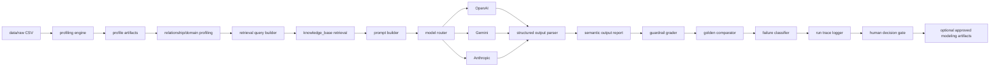
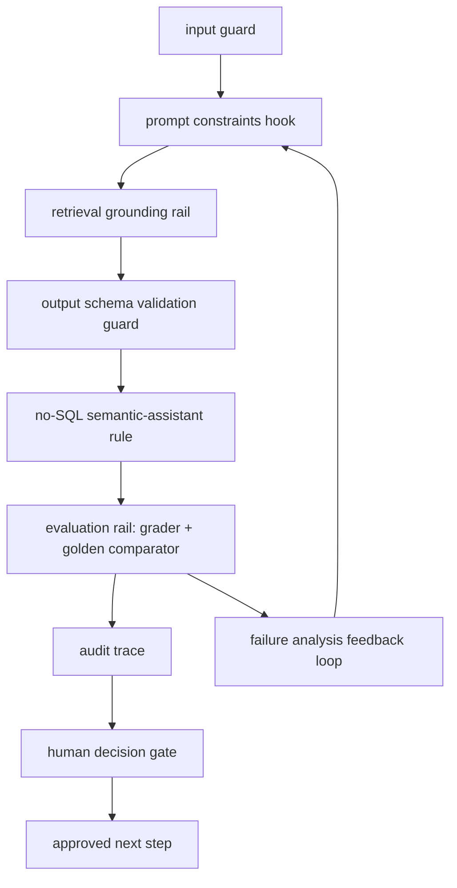

# Technical Flow

## 1. System purpose
This repository combines deterministic data profiling, semantic data-modeling reasoning, retrieval-grounded LLM interpretation, evaluation guardrails, and explicit human decision gates. It is an AI-assisted decision-support system, not an autonomous warehouse generator.

## 2. End-to-end pipeline table
| Step | Stage | Engineering discipline | Technique / terminology | Input | Output | Code or folder | Why it exists | Human-in-the-loop decision point | Evidence artifact |
|---:|---|---|---|---|---|---|---|---|---|
|1|Raw CSV ingestion|Data engineering|file-based ingestion|CSV files|loaded raw files|`data/raw/`|start traceable pipeline|confirm source scope|raw file inventory|
|2|Deterministic profiling|Data engineering|profile runner|raw CSV|table profiles|`src/profiling/profile_runner.py`|objective metrics|approve profiling run scope|profile JSON|
|3|Column-level profiling|Data engineering|null/distinct/uniqueness metrics|table data|column stats|`src/profiling/column_profiler.py`|key/grain evidence|review suspicious columns|column metrics|
|4|Composite key analysis|Data modeling|candidate key scoring|column stats|candidate keys|`src/profiling/key_detector.py`|grain/key alternatives|approve key policy|key candidates|
|5|Relationship inference|Data modeling|overlap/cardinality heuristics|profiles|relationship candidates|`src/profiling/relationship_detector.py`|dimension/fact hints|approve relationship assumptions|relationship JSON|
|6|Domain pattern profiling|Data modeling|domain signals|profiles+relationships|pattern findings|`test_inputs/.../cases/`|detect hybrid/snapshot/conflict|review ambiguity|domain findings|
|7|Retrieval query construction|AI engineering|query synthesis|profile artifacts|retrieval query|`src/agents/semantic_profiling_agent.py`|ground LLM with rules|validate query intent|retrieval query text|
|8|Knowledge base retrieval|AI engineering|BM25/keyword retrieval|query|context snippets|`src/retrieval/knowledge_retriever.py`|reduce hallucination|review applied rules|retrieved context|
|9|Prompt orchestration|AI engineering|template injection|artifacts+context|final prompt|`.ai/prompts/`|consistent reasoning contract|prompt policy review|prompt snapshot|
|10|Multi-model LLM execution|AI engineering|provider routing|prompt|raw model output|`src/models/model_router.py`|compare model behavior|provider run approval|raw output logs|
|11|Structured JSON extraction|AI engineering|schema extraction|raw text|semantic JSON|`src/agents/semantic_profiling_agent.py`|machine-checkable output|manual sanity check|parsed JSON|
|12|Human-readable report|AI engineering|markdown rendering|semantic JSON|report|`test_outputs/...`|stakeholder readability|review narrative risk|markdown report|
|13|Semantic grading|Evaluation engineering|rule-based grader|semantic JSON|grade result|`src/evaluation/semantic_output_grader.py`|baseline guardrail scoring|approve threshold|grader JSON|
|14|Golden comparison|Evaluation engineering|constraint comparator|actual+golden|comparison result|`src/evaluation/golden_comparator.py`|case-level correctness checks|review mismatches|comparator JSON|
|15|Failure analysis|Evaluation engineering|category classifier|grading/comparison|failure tags|`src/evaluation/failure_classifier.py`|faster debugging|accept root-cause hypothesis|failure labels|
|16|Run trace/observability|Governance / responsible AI|trace logging|run metadata|trace records|`src/runtime/run_trace.py`|auditability|review audit trace|trace logs|
|17|Human decision gate|Governance / responsible AI|approval workflow|assistant output|approved/rejected decision|`docs/evaluation/`|prevent autonomous finalization|required approval|decision record|
|18|Optional future modeling artifacts|Governance / responsible AI|post-approval generation|approved decision|optional draft artifacts|future module|separate from semantic reasoning|explicit opt-in|approval artifact|

## 3. Mermaid architecture diagram

## 4. AI guardrail / rail diagram

## 5. Terminology glossary
- **raw ingestion**: landing source files before semantic interpretation.
- **deterministic profiling**: repeatable metric extraction without LLM inference.
- **grain**: what one row represents.
- **candidate key**: possible identifying column set needing validation.
- **natural key**: source/business identifier.
- **surrogate key**: warehouse-generated technical identifier.
- **source-derived semantic key**: engineered key for reconciled source identity.
- **fact**: event/measurement-centric entity.
- **dimension**: descriptive context entity.
- **snapshot fact**: periodic state capture at fixed intervals.
- **factless fact**: event occurrence table with minimal/no additive measures.
- **bridge table**: many-to-many association structure.
- **SCD**: slowly changing dimension behavior.
- **RAG**: retrieval-augmented generation.
- **BM25 / keyword retrieval**: lexical ranking for relevant rule documents.
- **semantic reasoning**: model interpretation of profiling evidence.
- **guardrail**: constraint/check preventing unsafe conclusions.
- **human-in-the-loop**: required human approval for final decisions.
- **golden expected output**: machine-readable expected behavior contract.
- **failure analysis**: structured diagnosis of model errors.
- **regression testing**: repeated benchmark runs to detect degradations.
- **observability / audit trail**: run-time metadata for reproducibility and governance.
