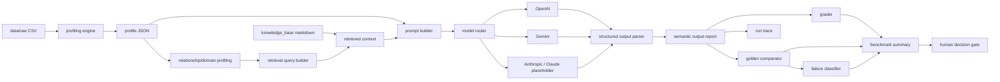
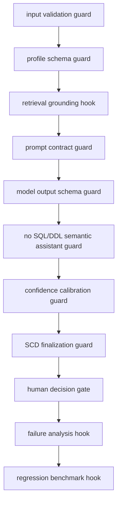
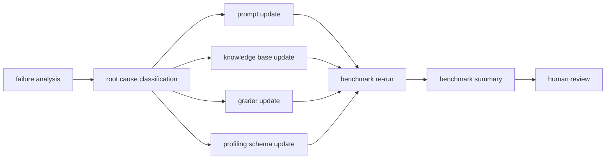

# AI Data Modeling Copilot — Technical Flow Architecture

## Introduction

The AI Data Modeling Copilot is a **human-in-the-loop decision-support system** that combines:
- data engineering profiling,
- semantic data modeling reasoning,
- RAG / knowledge-base grounding,
- multi-model LLM execution,
- guardrails,
- evaluation,
- audit trace logging,
- and explicit human decision gates.

It is designed to help engineers evaluate modeling choices with evidence. It is **not** an autonomous data warehouse generator.

## End-to-End Flow Mapping

| Step | Stage | Discipline | Technique / terminology | Input | Output | Repo folder/file | Why it exists | Senior-level meaning | Evidence artifact |
|---:|---|---|---|---|---|---|---|---|---|
| 1 | Raw CSV ingestion | Data engineering | Source ingestion, schema sampling | Raw CSV files | Parsed tabular inputs | `src/profiling/csv_reader.py`, `data/` | Establishes reproducible input boundary | Controls variability before AI reasoning | Input file manifest, sampled records |
| 2 | Deterministic profiling | Data engineering | Rule-based profiling pass | Parsed tables | Baseline profile stats | `src/profiling/profile_runner.py` | Generates non-LLM evidence layer | Reduces hallucination risk by grounding | Combined profile JSON |
| 3 | Column-level profiling | Data quality | Null/distinct/uniqueness analysis | Baseline profile input | Per-column diagnostics | `src/profiling/column_profiler.py` | Quantifies signal quality and data shape | Enables grain/key confidence calibration | Column metrics in profile JSON |
| 4 | Candidate composite key analysis | Data modeling | Candidate natural/business key search | Column stats + sampled rows | Composite key candidates | `src/profiling/key_detector.py` | Tests key hypotheses before semantic claims | Prevents premature grain commitment | Candidate key block in profile JSON |
| 5 | Relationship inference | Data modeling | Joinability/cardinality inference | Profiled columns + overlaps | Relationship candidates | `src/profiling/relationship_detector.py` | Identifies likely dimension/fact link paths | Supports conformed entity reasoning | Relationship candidate list |
| 6 | Semantic/domain profiling | AI engineering | Domain-pattern interpretation | Profiling bundle | Semantic cues and ambiguity notes | `src/agents/semantic_profiling_agent.py` | Converts technical signals into modeling hypotheses | Bridges stats to business semantics | Semantic output JSON |
| 7 | RAG query construction | AI engineering | Retrieval query builder | Semantic problem statement | Retrieval queries | `src/retrieval/knowledge_retriever.py` | Narrows search to relevant modeling rules | Improves explainability and consistency | Retrieval query log |
| 8 | Knowledge-base retrieval | Knowledge engineering | BM25 / lexical retrieval | Retrieval queries + KB corpus | Retrieved context passages | `knowledge_base/`, `src/retrieval/knowledge_retriever.py` | Grounds reasoning in documented standards | Encodes institutional modeling policy | Retrieved context artifacts |
| 9 | Prompt orchestration | LLM engineering | Prompt template + contract | Profile evidence + retrieved context | Model-ready prompt | `src/agents/semantic_profiling_agent.py` | Forces structured, constrained generation | Implements controllable reasoning interface | Prompt text in run artifacts |
| 10 | Model execution | LLM operations | Multi-model routing | Prompt payload | Raw model response | `src/models/model_router.py` | Allows provider comparison and fallback | Separates orchestration from model vendor | Raw output capture |
| 11 | Structured JSON extraction | AI reliability | Output parsing + schema shaping | Raw model response | Structured semantic JSON | `src/validation/semantic_output_validator.py` | Converts free text into machine-checkable output | Enables deterministic grading workflows | Validated semantic JSON |
| 12 | Human-readable report generation | Analytics engineering | Markdown evidence rendering | Structured semantic output | Case report | `test_outputs/evaluation/case_reports/` | Makes output reviewable by humans | Supports governance-ready communication | Per-case markdown report |
| 13 | Evaluation/grading | AI evaluation | Rule-based grader | Structured semantic output | Grading result | `src/evaluation/semantic_output_grader.py` | Measures alignment to expected behavior | Quantifies model quality dimensions | Grader JSON section |
| 14 | Golden expected comparison | AI evaluation | Semantic comparator constraints | Actual output + golden expected JSON | Decision-area scores, failures | `src/evaluation/golden_comparator.py`, `test_inputs/semantic_profiling/golden/` | Detects forbidden grains / overconfidence | Provides regression-safe semantic checks | Comparator result JSON |
| 15 | Failure classification | AI evaluation | Failure taxonomy mapping | Comparator + grader outcomes | Root-cause categories and fix targets | `src/evaluation/failure_classifier.py` | Turns failures into actionable engineering backlog | Improves iteration efficiency | Failure taxonomy JSON |
| 16 | Run trace logging | Platform reliability | Audit trace / provenance logging | Pipeline execution events | Run trace metadata | `src/runtime/run_trace.py`, `test_outputs/runs/` | Ensures reproducibility and accountability | Critical for governance and postmortems | `run_trace.json` |
| 17 | Human decision gate | Data governance | Decision gate (`requires_human_decision=true`) | All evidence and scores | Approved/held modeling decision | Semantic output contract + reviewer process | Prevents autonomous schema finalization | Keeps business ownership with humans | Decision notes / approval record |
| 18 | Feedback loop into prompt / KB / grader | Continuous improvement | Prompt/KB/grader iteration | Failure analysis + benchmark history | Updated benchmark behavior | `docs/evaluation/`, `scripts/run_benchmark.py` | Enables controlled quality improvement | Converts incidents into institutional learning | Benchmark summary and iteration logs |

## Mermaid Diagram 1 — End-to-End Data + AI Flow

## Mermaid Diagram 2 — Guardrail / Hook / Evaluation Flow

## Mermaid Diagram 3 — Feedback Loop

## Terminology Glossary

- **raw ingestion**: controlled loading of source files prior to profiling.
- **deterministic profiling**: non-LLM, reproducible statistics and structural analysis.
- **column-level profiling**: per-column null/distinct/uniqueness/type signals.
- **grain**: the row-level business meaning represented by one record.
- **candidate key**: tentative unique identifier supported by evidence.
- **business key**: identifier meaningful in business operations.
- **natural key**: key from source data rather than generated surrogates.
- **surrogate key**: synthetic warehouse identifier independent of source keys.
- **source-derived semantic key**: source-linked identifier inferred for semantic modeling.
- **fact table**: event/measurement-oriented analytical structure.
- **dimension table**: descriptive context used to analyze facts.
- **bridge table**: associative table resolving many-to-many relationships.
- **factless fact**: event/occurrence table without additive numeric measures.
- **snapshot fact**: periodic or accumulating state capture over time.
- **SCD**: slowly changing dimension strategy for attribute history handling.
- **RAG**: retrieval-augmented generation using external context.
- **BM25 / lexical retrieval**: term-based ranking for relevant document retrieval.
- **semantic reasoning**: interpretation of technical evidence into business-model hypotheses.
- **guardrail**: constraint preventing unsafe or non-compliant outputs.
- **hook**: extension point where evaluation or controls are applied.
- **decision gate**: explicit checkpoint requiring human approval.
- **golden expected output**: benchmark expectation contract for semantic behavior.
- **failure analysis**: classification and diagnosis of incorrect model behavior.
- **audit trace**: execution provenance for reproducibility and governance.
- **benchmark**: repeatable test suite for comparative model quality measurement.

---

**Architecture stance:** this repository supports **AI-assisted semantic modeling decision support** and **human-approved modeling decisions**; it does not claim autonomous or guaranteed-correct warehouse design.
